## بسم الله الرحمن الرحيم {.arabic-opening-slide}

::: {.arabic-opening dir="rtl" lang="ar"}
::: {.arabic-wa}

:::

::: {.hamdala}
والحمد لله، والصلاة والسلام على رسول الله، وعلى آله وصحبه اجمعين
:::
:::

## Mahmoud Abdalla Career timeline {.timeline-slide}

:::: {.timeline .fragment-slide .jobfair-timeline}
::: {.event .fragment data-label="2009" data-fragment-index="0"}
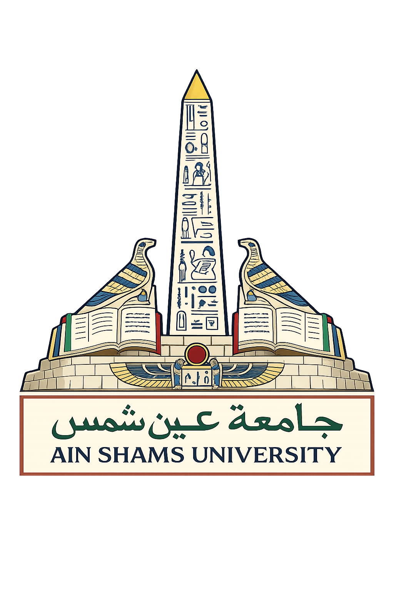{.timeline-logo .ain-shams-logo .fragment data-fragment-index="0"}

**Graduated from Ain Shams University** 
Mechatronics engineering
Graduation project mine field robot for the Egyptian ministry of defense .

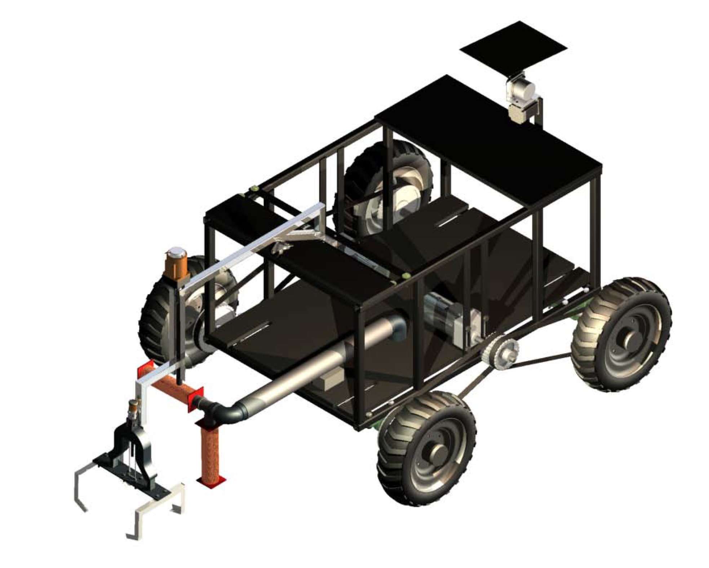{.robot-image .fragment .fade-in-then-out data-fragment-index="0"}

روبوت إزالة الألغام

:::

::: {.event .fragment data-label="2013" data-fragment-index="1"}
{.timeline-logo .cu-logo .fragment data-fragment-index="1"}

**Graduated from Carleton University** Master's project Reconfigurable robot for security applications for Allen Vanguard.

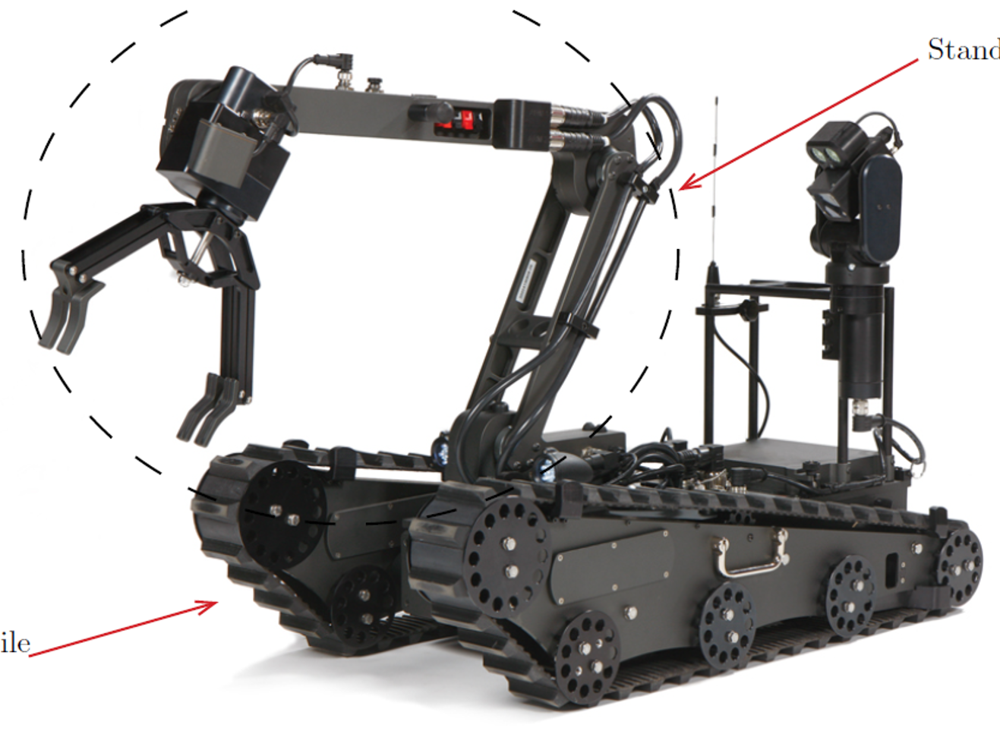{.allen-vanguard-image .fragment .fade-in-then-out data-fragment-index="1"}

روبوت أمني قابل للتكوين

:::

::: {.event .fragment data-label="2014" data-fragment-index="2"}
{.timeline-logo .polytainers-logo .fragment data-fragment-index="2"}

**Worked at polytainers ** A packaging company.

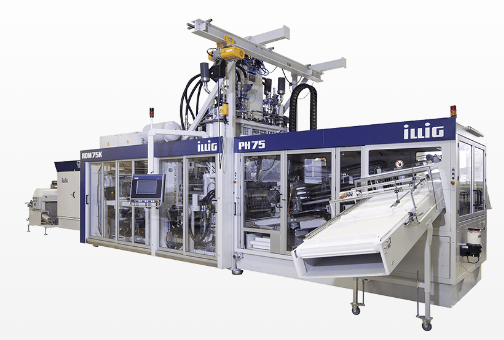{.omron-image .fragment .fade-in-then-out data-fragment-index="2"}

آلة تغليف صناعية

:::

::: {.event .fragment data-label="2014" data-fragment-index="3"}
{.timeline-logo .seneca-logo .fragment data-fragment-index="3"}

**Lecturer at Seneca College** Taught PLCs Omron systems

{.omron-image .fragment .fade-in-then-out data-fragment-index="3"}

برمجة المتحكمات المنطقية أومرون

:::

::: {.event .fragment data-label="2014/2015" data-fragment-index="4"}
{.timeline-logo .seneca-logo .fragment data-fragment-index="4"}

**Mathematics student** Studied mathematics at Toronto Metropolitan University

{.omron-image .fragment .fade-in-then-out data-fragment-index="4"}

دراسة الرياضيات

:::

::: {.event .fragment data-label="2015" data-fragment-index="5"}
{.timeline-logo .seneca-logo .fragment data-fragment-index="5"}

**Lecturer at Centennial College ** Taught electric circuits labs and industrial electronics

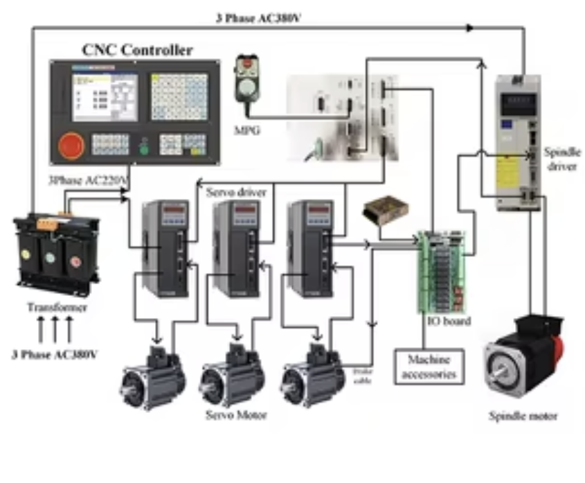{.omron-image .fragment .fade-in-then-out data-fragment-index="5"}

إلكترونيات صناعية ودوائر كهربائية

:::

::: {.event .fragment data-label="2016" data-fragment-index="6"}
{.timeline-logo .seneca-logo .fragment data-fragment-index="6"}

**Mathematics student** Studied mathematics at Concordia

{.omron-image .fragment .fade-in-then-out data-fragment-index="6"}

دراسة الرياضيات

:::

::: {.event .fragment data-label="2017" data-fragment-index="7"}
{.timeline-logo .seneca-logo .fragment data-fragment-index="7"}

**Research Assistant at McGill University** Modelled ant colony 

{.omron-image .fragment .fade-in-then-out data-fragment-index="7"}

نمذجة مستعمرة النمل

:::

::: {.event .fragment data-label="2018" data-fragment-index="8"}
{.timeline-logo .seneca-logo .fragment data-fragment-index="8"}

**Research Assistant at McGill University** Applied AI ( VGG network) for Style transfer

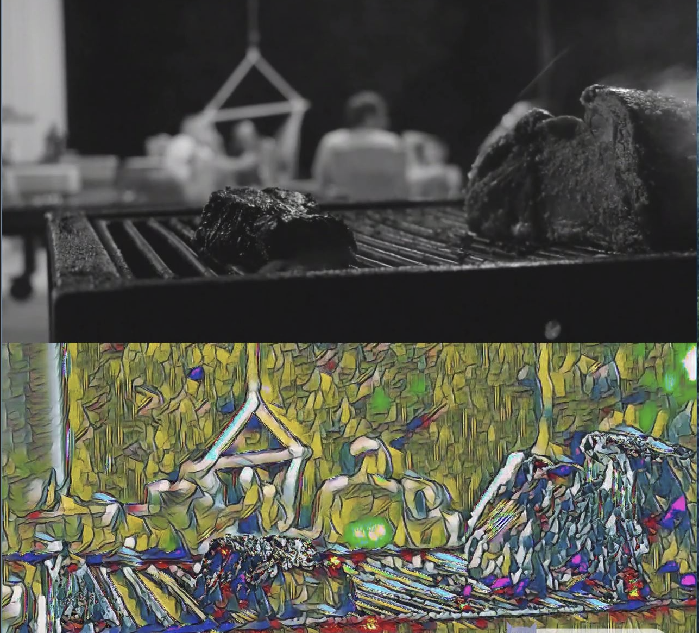{.omron-image .fragment .fade-in-then-out data-fragment-index="8"}

نقل الأسلوب الفني بالذكاء الاصطناعي

:::

::: {.event .fragment data-label="2018/2019" data-fragment-index="9"}
{.timeline-logo .seneca-logo .fragment data-fragment-index="9"}

**Research Assistant at McGill University** Applied computer vision principles to Slit lamps (an ophthalmology application)

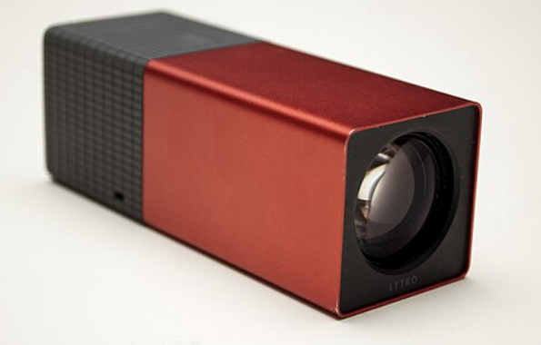{.omron-image .fragment .fade-in-then-out data-fragment-index="9"}

رؤية حاسوبية لطب العيون

:::

::: {.event .fragment data-label="2019/2020" data-fragment-index="10"}
{.timeline-logo .seneca-logo .fragment data-fragment-index="10"}

**Research Assistant at McGill University** Reduced fMRI scan time from 30mins to 15 mins

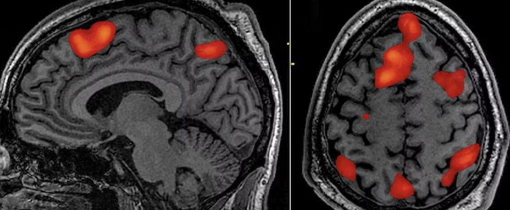{.omron-image .fragment .fade-in-then-out data-fragment-index="10"}

تقليل وقت مسح الرنين المغناطيسي إلى النصف

:::

::: {.event .fragment data-label="2021" data-fragment-index="11"}
{.timeline-logo .seneca-logo .fragment data-fragment-index="11"}

**Research Assistant at McGill University** Control of DNA inside Nanopore (semiconductor chip)

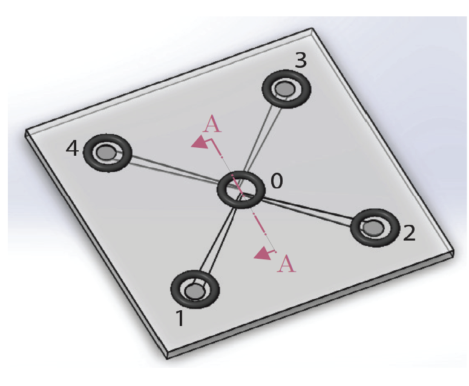{.omron-image .fragment .fade-in-then-out data-fragment-index="11"}

التحكم في الحمض النووي بشريحة نانوبور

:::

::: {.event .fragment data-label="2022" data-fragment-index="12"}
{.timeline-logo .seneca-logo .fragment data-fragment-index="12"}

**Research analyst audio division** Data collection for Deep learning for Virtual reality headset

{.omron-image .fragment .fade-in-then-out data-fragment-index="12"}

تعلم عميق للواقع الافتراضي — ميتا

:::

::: {.event .fragment data-label="2023" data-fragment-index="13"}
{.timeline-logo .seneca-logo .fragment data-fragment-index="13"}

**Master's student**CAD parts for CNC

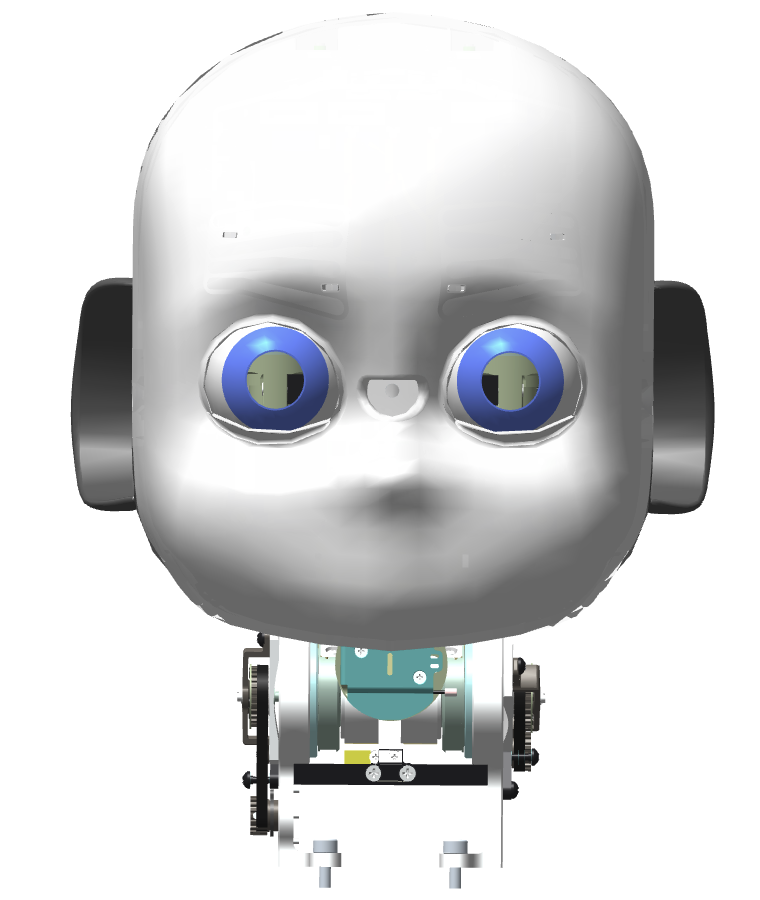{.omron-image .fragment .fade-in-then-out data-fragment-index="13"}

التحكم في الروبوت

:::

::: {.event .fragment data-label="2024" data-fragment-index="14"}
{.timeline-logo .seneca-logo .fragment data-fragment-index="14"}

**AI diploma** Applied MobileNet to mask detection 

{.omron-image .fragment .fade-in-then-out data-fragment-index="14"}

كشف الكمامة بشبكة MobileNet

:::

::: {.event .fragment data-label="2024" data-fragment-index="15"}
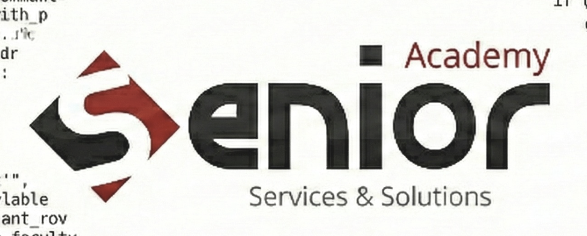{.timeline-logo .seneca-logo .fragment data-fragment-index="15"}

**DevOps** Ansible Configuration Management

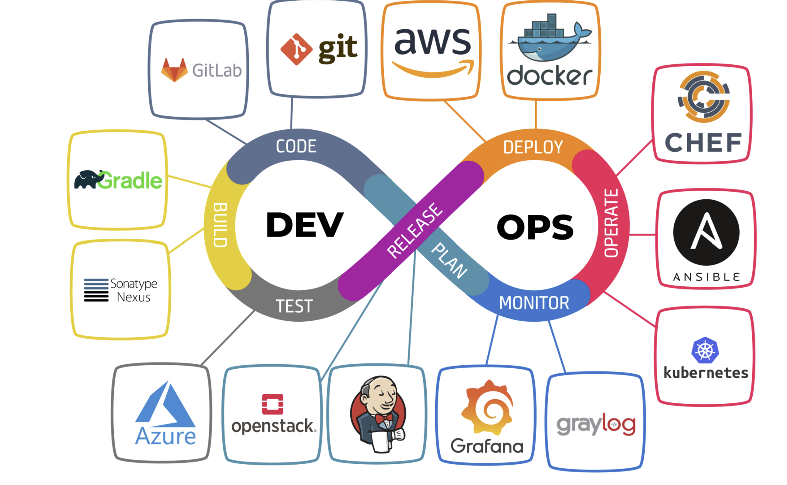{.omron-image .fragment .fade-in-then-out data-fragment-index="15"}

إدارة التهيئة بأنسيبل

:::

::: {.event .fragment data-label="2024" data-fragment-index="16"}
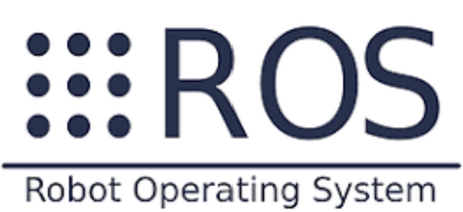{.timeline-logo .seneca-logo .fragment data-fragment-index="16"}

**ROS application**

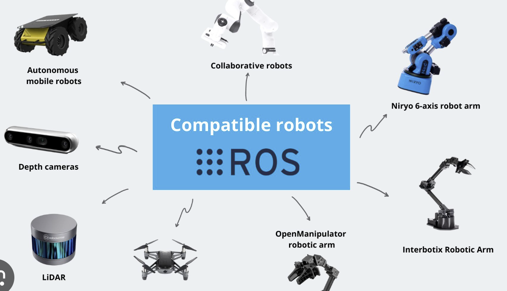{.omron-image .fragment .fade-in-then-out data-fragment-index="16"}

تطبيق نظام تشغيل الروبوت ROS

:::

::: {.event .fragment data-label="2025" data-fragment-index="17"}
{.timeline-logo .seneca-logo .fragment data-fragment-index="17"}

**EE Master's student/TA** Filtering Noise  from sensors for vehicle lane changing 

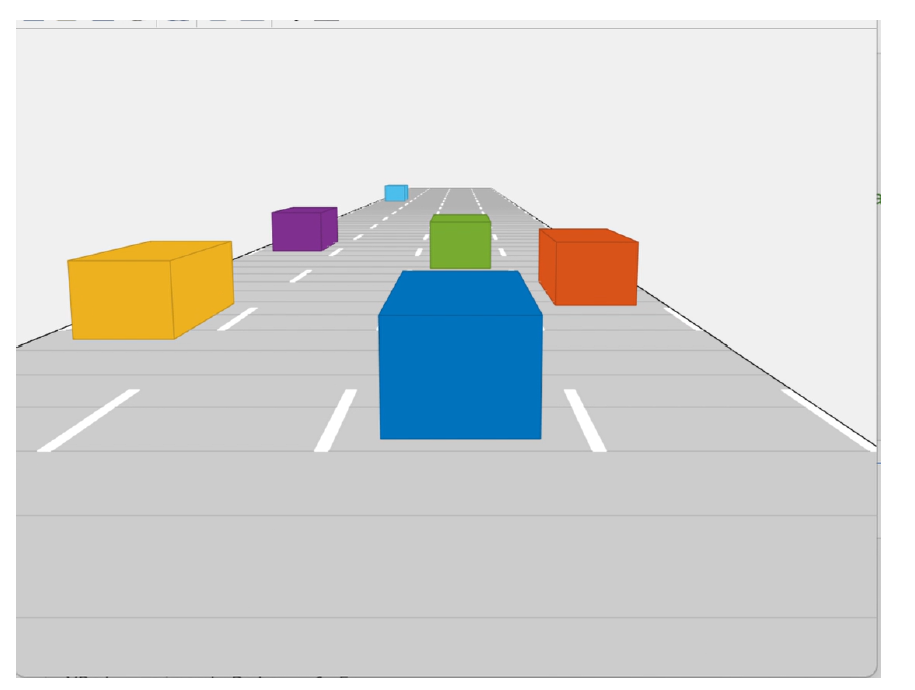{.omron-image .fragment .fade-in-then-out data-fragment-index="17"}

تصفية ضوضاء المستشعرات لتغيير المسار

:::

::: {.event .fragment data-label="2025" data-fragment-index="18"}
{.timeline-logo .seneca-logo .fragment data-fragment-index="18"}

**EE Master's student/TA** Applied CV to distinguish Palm trees via Stereo Camera in ROS

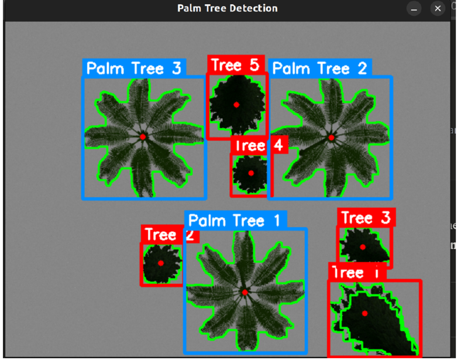{.omron-image .fragment .fade-in-then-out data-fragment-index="18"}

كشف أشجار النخيل بكاميرا ستيريو

:::

::: {.event .fragment data-label="2025" data-fragment-index="19"}
{.timeline-logo .seneca-logo .fragment data-fragment-index="19"}

**EE Master's student/TA** Studying Renewable PV plus Wind in Dumat aljandal KSA 

{.omron-image .fragment .fade-in-then-out data-fragment-index="19"}

طاقة شمسية وريحية في دومة الجندل

:::

::: {.event .fragment data-label="2025" data-fragment-index="20"}
{.timeline-logo .seneca-logo .fragment data-fragment-index="20"}

**EE Master's student/TA** Flood detection using DDS measuring latency in ROS

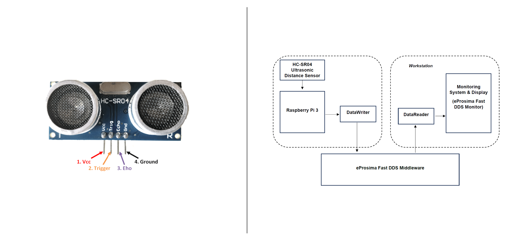{.omron-image .fragment .fade-in-then-out data-fragment-index="20"}

كشف الفيضانات بقياس زمن الاستجابة

:::

::: {.event .fragment data-label="2026" data-fragment-index="21"}
{.timeline-logo .seneca-logo .fragment data-fragment-index="21"}

**EE Master's student/TA** Applying AI (BEVnet to detect traversable terrain  for robots)

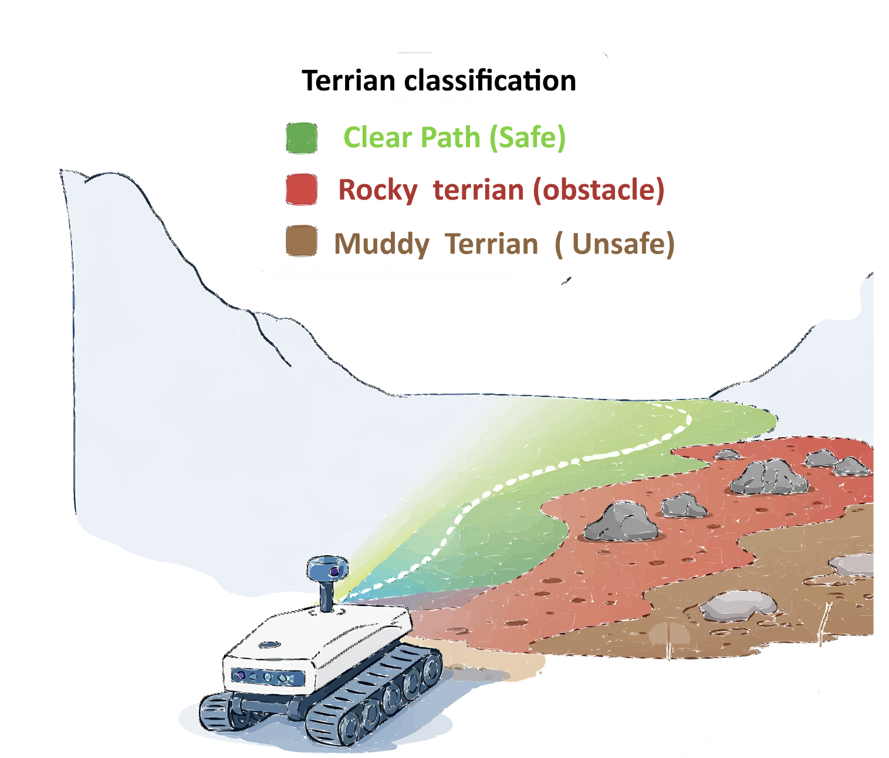{.omron-image .fragment .fade-in-then-out data-fragment-index="21"}

تصنيف التضاريس للروبوتات — BEVnet

:::

::: {.event .fragment data-label="Skills" data-fragment-index="22"}
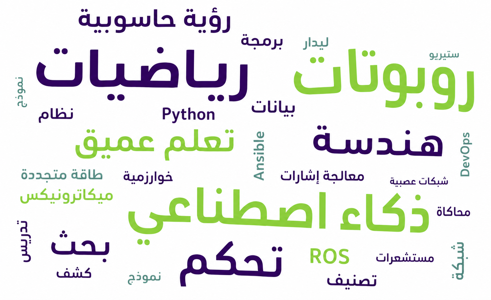{.omron-image .fragment data-fragment-index="22"}
:::

::: {.event .fragment data-label="Next" data-fragment-index="23"}
**Expected to graduate in the next few months** Bringing simulation, data analysis, and teaching strengths to a potential team.

{.omron-image .fragment .fade-in-then-out data-fragment-index="23"}

تواصل معي

:::
::::

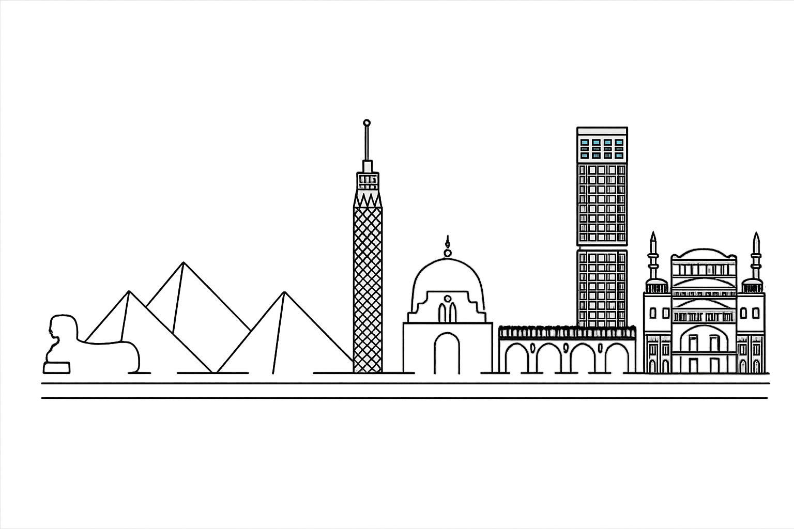{.cairo-skyline .fragment .fade-in-then-out data-fragment-index="0"}
{.ottawa-skyline .fragment .fade-in-then-out data-fragment-index="1"}
{.toronto-skyline .fragment .fade-in-then-out data-fragment-index="2"}
{.toronto-skyline .fragment .fade-in-then-out data-fragment-index="3"}
{.toronto-skyline .fragment .fade-in-then-out data-fragment-index="4"}
{.toronto-skyline .fragment .fade-in-then-out data-fragment-index="5"}
{.montreal-skyline .fragment .fade-in-then-out data-fragment-index="6"}
{.montreal-skyline .fragment .fade-in-then-out data-fragment-index="7"}
{.montreal-skyline .fragment .fade-in-then-out data-fragment-index="8"}
{.montreal-skyline .fragment .fade-in-then-out data-fragment-index="9"}
{.montreal-skyline .fragment .fade-in-then-out data-fragment-index="10"}
{.montreal-skyline .fragment .fade-in-then-out data-fragment-index="11"}
{.seattle-skyline .fragment .fade-in-then-out data-fragment-index="12"}
{.dahran-skyline .fragment .fade-in-then-out data-fragment-index="13"}
{.cairo-skyline .fragment .fade-in-then-out data-fragment-index="14"}
{.cairo-skyline .fragment .fade-in-then-out data-fragment-index="15"}
{.cairo-skyline .fragment .fade-in-then-out data-fragment-index="16"}
{.dahran-skyline .fragment .fade-in-then-out data-fragment-index="17"}
{.dahran-skyline .fragment .fade-in-then-out data-fragment-index="18"}
{.dahran-skyline .fragment .fade-in-then-out data-fragment-index="19"}
{.dahran-skyline .fragment .fade-in-then-out data-fragment-index="20"}
{.dahran-skyline .fragment .fade-in-then-out data-fragment-index="21"}

Cairo, Egypt

Ottawa, Canada

Toronto, Canada

Montreal, Canada

Seattle, USA

Dhahran, KSA

Cairo, Egypt

Dhahran, KSA

